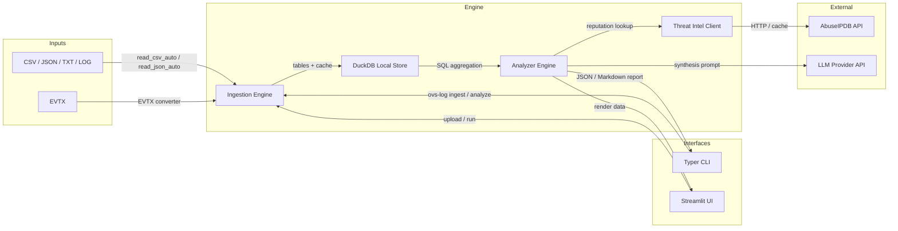
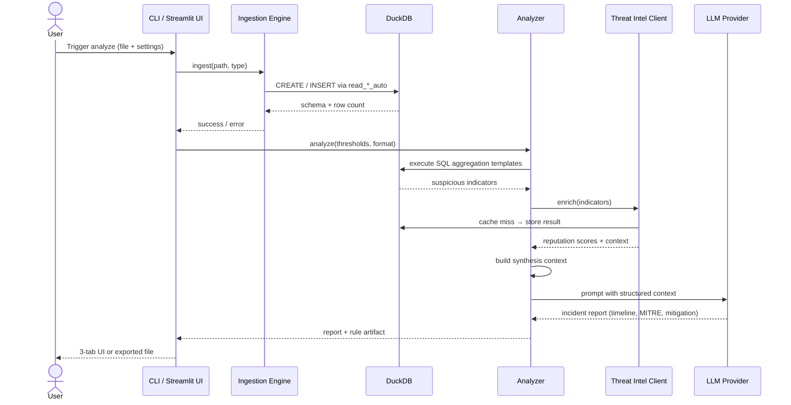

# OVS-Log Architecture Specification

This document defines the technical architecture of **OVS-Log** for the MVP. It expands on `docs/PRD.md`, `docs/cli_design.md`, and `docs/streamlit_ui.md`, and maps the implementation to the Linear backlog epics **OVD-5 through OVD-9**.

## 1. Design Principles

- **Local-first**: All parsing, aggregation, and enrichment states live in a local DuckDB instance.
- **Privacy-preserving**: Raw logs are never sent externally; only structured, aggregated context is passed to the optional LLM provider.
- **CLI/UI parity**: The Typer CLI and the Streamlit UI share the same engine, so behavior and outputs are identical.
- **Modular**: Ingestion, analysis, threat-intel, and LLM synthesis are independent services orchestrated by a thin workflow layer.

## 2. System Components

| Component           | Role                                                                       | Backlog       |
|---------------------|----------------------------------------------------------------------------|---------------|
| Ingestion Engine    | Reads CSV, JSON, TXT, LOG, and EVTX into DuckDB with schema detection      | OVD-5         |
| DuckDB Local Store  | Columnar analytical state and result cache                                 | OVD-5 / OVD-6 |
| Analyzer            | Runs SQL aggregation templates, orchestrates enrichment and LLM synthesis  | OVD-6         |
| Threat Intel Client | Queries AbuseIPDB for IP reputation and caches results locally             | OVD-6         |
| LLM Provider        | Generates incident timeline, MITRE ATT&CK mapping, and mitigation guidance | OVD-6         |
| Typer CLI           | `ingest`, `analyze`, and `export-rule` commands                            | OVD-7         |
| Streamlit UI        | Single-page upload, run, and 3-tab results view                            | OVD-8         |
| Packaging & Tests   | Entrypoints, automated tests, and BOTS v1 validation                       | OVD-9         |

## 3. Component Diagram

## 4. Sequence Diagram: The "Analyze" Flow

## 5. State Management

- **Analytical state**: Owned by DuckDB. Tables persist normalized events, aggregation results, threat-intel cache, and generated reports. This keeps the CLI stateless and the Streamlit UI resilient to refreshes.
- **Streamlit state**: `st.session_state` holds only lightweight UI state: the current upload metadata, the API key, chunk-size slider, and target format dropdown. Large payloads (raw log content, analysis results) are read from or written to DuckDB so that reruns do not reload the file from memory.
- **Threat-intel cache**: A small cache table in DuckDB prevents repeated API calls for the same indicator during a single session and lets the analyzer work offline when the API key is absent or rate-limited.

## 6. Mapping to Linear Backlog

| Epic  | Architectural Concern                                                    |
|-------|--------------------------------------------------------------------------|
| OVD-5 | Ingestion engine, DuckDB schema, and normalization of raw log formats    |
| OVD-6 | Analyzer, threat-intel client, LLM synthesis, and incident report schema |
| OVD-7 | Typer CLI command layer and output formatting                            |
| OVD-8 | Streamlit UI, session state, and 3-tab presentation                      |
| OVD-9 | Package entrypoints, automated tests, and BOTS v1 validation flow        |

## 7. Key Design Decisions

- DuckDB serves as both the storage layer and the analytical engine, eliminating the need for a separate database process.
- The LLM receives only structured aggregations (top IPs, endpoints, error rates, reputation context), not full raw logs, to minimize token usage and preserve privacy.
- The CLI and UI share the same `Analyzer` workflow, so a result validated in the dashboard can be reproduced identically from the command line.
- Threat-intel enrichment is optional; the engine degrades gracefully when the AbuseIPDB API key is missing or the service is unavailable.
